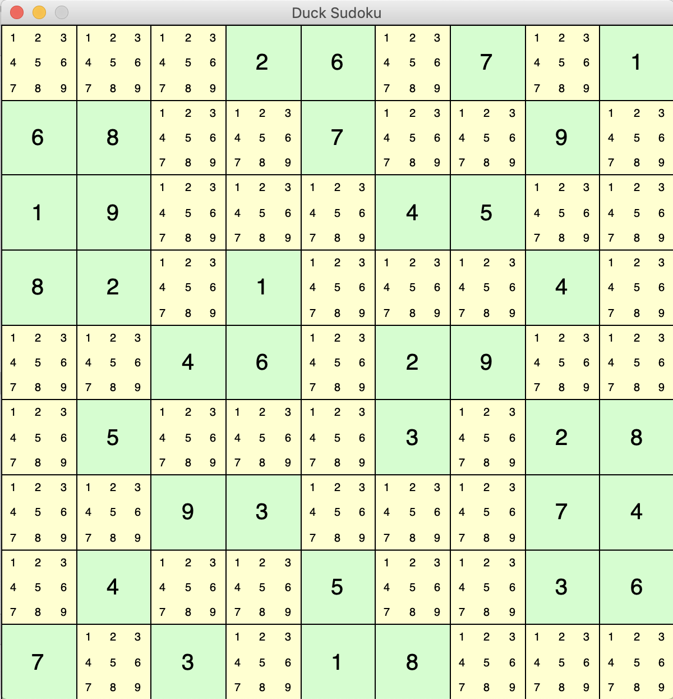
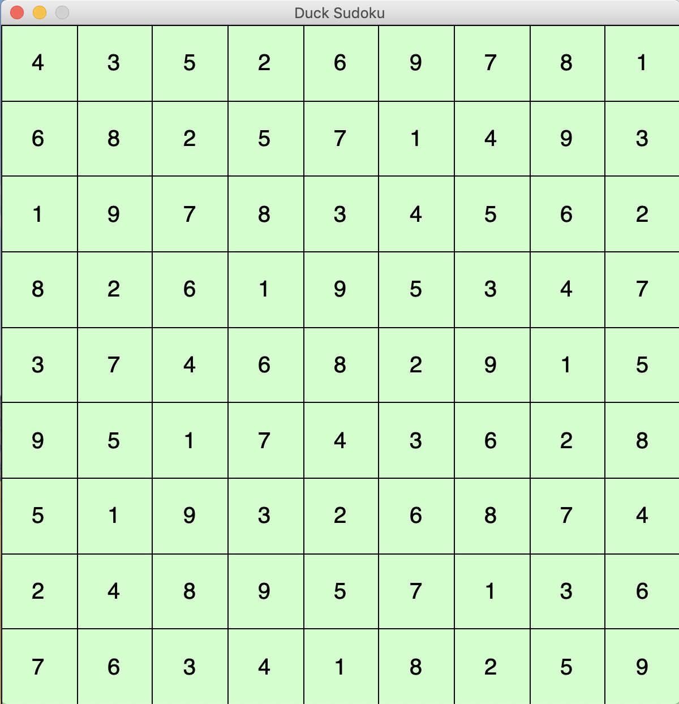
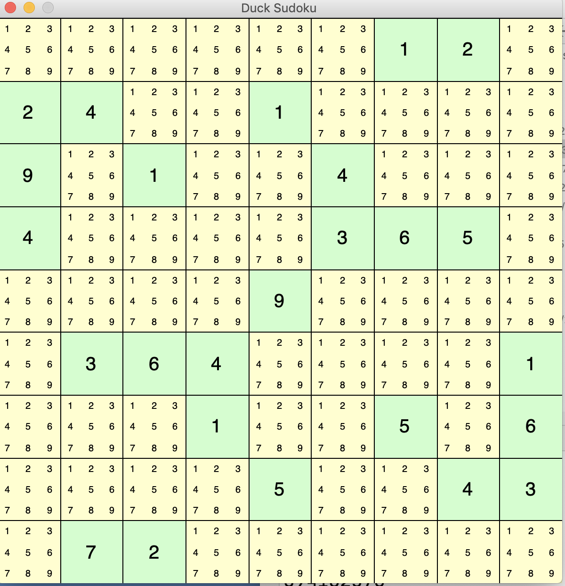
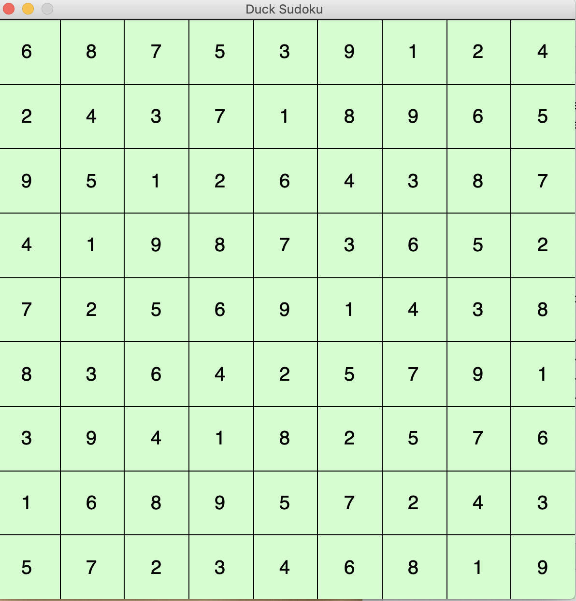

# Solving Simple Sudoku Puzzles

## Outline 

In this part you will construct
a solver that uses *constraint propagation* to 
solve simple puzzles.  Later 
you will use the constraint propagation 
solver as one part of a solver that performs 
recursive guess-and-check search to solve 
*all* Sudoku puzzles.  

Recall that when we created the `Board`
object, we created not only the primary
`tiles` list of lists, but also a list 
of `groups` that contained the same 
`Tile` objects grouped by row, column, 
and block.  This simplified our consistency 
check.  It is also crucial to the way we will 
approach constraint propagation in this part 
of the project. It is crucial to understand 
that these are the very same `Tile` objects 
*aliased* in multiple lists. 
If this is not crystal clear to you, 
be sure to read or re-read the 
[supplement on aliasing](https://uo-cis211.github.io/chapters/04_1_Alias).

You will first write 
a method `naked_single` that implements a basic
solution tactic.  The *naked single* tactic 
is based on the rule that a tile value may not 
be duplicated in any row, column, or block. 
When `naked_single` is working, you will have 
a working solver that can solve  
some very simple Sudoku puzzles. 

Next you will implement a tactic called 
*hidden single*.   The hidden single tactic 
is based on the rule that each symbol must 
appear at least once in each column, row, 
and block ... so if there is only one position 
in which it can go, it must go in that position! 
I will provide you some 
high level pseudocode and guidance, but you 
will write the method.  When you have 
implemented method `hidden_single` as well as 
`naked_single`, you will have a complete 
solver for most of the Sudoku problems 
you find online that are marked *easy*. 


When a your constraint propagation solver cannot
completely solve a puzzle, it may still be able 
to fill in some tiles. 

```
$ more data/board-sandiway-intermediate.sdk
.2.6.8...
58...97..
....4....
37....5..
6.......4
..8....13
....2....
..98...36
...3.6.9.

$ python3 sudoku.py data/board-sandiway-intermediate.sdk
.2.6.8...
58...97..
....4....
37....5..
6......74
..8....13
...92....
..98...36
...3.6.9.
```

In the example above, only a few tiles have been filled in,
  because only simple tactics have been used.  If you use the
   --display option, you can see progress in filling in tiles,
  including elimination of some candidates:

# Inferring Values

There are many tactics for inferring the value a tile must 
take.  We will use two of the most basic tactics described at
[The Sadman Sudoku site](http://www.sadmansoftware.com/sudoku/solvingtechniques.php). 
You may also find it useful to review the *pencil marks* 
technique that many people use to keep track of possible 
tile values, because our *candidates* structure is essentially
a Python representation of pencil marks;  
[Sadman's tutorial on pencil marks](https://www.learn-sudoku.com/pencil-marks.html)
is a good introduction. 

## Naked Single

The simplest of these is called "naked single", "sole candidate", or 
"singleton".  If you solve Sudoku by hand, you may use "pencil marks"
to indicate the values that can appear in a tile.  If a 3 appears
anywhere in the row, you mark off the 3 in the "pencil marks". 
If a 3 appears anywhere in the column or block, you likewise 
mark off the "3" in the pencil marks for tile.  If there is only 
one pencil mark that is not crossed off, then we can determine 
that the tile must hold that value. 

If we applied this tactic tile-by-tile, scanning the row, column, 
and block that the tile belongs to, we would scan each row, column, and block 
in a 9x9 puzzle up to 81 times.  We can do much better.  
Rather than focusing on one cell, we will work group-by-group. 
We will scan each group twice:  Once to get the set of symbols 
used in that group, and a second time to eliminate those symbols
from the candidate sets of all the unknown tiles in the group. 

What should the naked_single method return?  There are three 
possible outcomes: 

* We made some progress in solving the puzzle, by eliminating 
  at least one candidate in at least one tile.  (This includes 
  the case in which we were able to determine a tile 
  value.)
  
* We made no progress --- after applying Naked Single, the 
  candidate sets are exactly as they were before. 
  
* We eliminated all the candidates from some tile, showing that 
  this puzzle is not solvable.  Note that this can happen even if 
  there are no duplicates in any row, column, or block! 
  
It is most convenient to have the return value of the result 
be an indicator of whether or not there was progress.  We can 
treat the third possibility, an unsolvable puzzle, separately
in the next stage of development.  

We will add to the Tile class a method for eliminating 
candidates and potentially changing the tile value from 
UNKNOWN to one of the CHOICES.  It will return an indication 
of whether the candidate list was changed: 

```python
    def remove_candidates(self, used_values: Set[str]) -> bool:
        """The used values cannot be a value of this unknown tile.
        We remove those possibilities from the list of candidates.
        If there is exactly one candidate left, we set the
        value of the tile.
        Returns:  True means we eliminated at least one candidate,
        False means nothing changed (none of the 'used_values' was
        in our candidates set).
        """
        new_candidates = self.candidates.difference(used_values)
        if new_candidates == self.candidates:
            # Didn't remove any candidates
            return False
        self.candidates = new_candidates
        if len(self.candidates) == 1:
            self.set_value(new_candidates.pop())
        self.notify_all(TileEvent(self, EventKind.TileChanged))
        return True
```

```Tile.remove_candidates``` can be called from ```Board.naked_single```, 
with this header: 

```python
    def naked_single(self) -> bool:
        """Eliminate candidates and check for sole remaining possibilities.
        Return value True means we crossed off at least one candidate.
        Return value False means we made no progress.
        """
```

I leave writing ```naked_single``` to you.  We can test it 
with an example from Sadman Sudoku: 

```python
class TestNakedSingle(unittest.TestCase):
    """Simple test of Naked Single using row, column, and block
    constraints.  From Sadman Sudoku,
    http://www.sadmansoftware.com/sudoku/nakedsingle.php
    """
    def test_sadman_example(self):
        board = Board()
        board.set_tiles([".........", "......1..", "......7..",
                         "......29.", "........4", ".83......",
                         "......5..", ".........", "........."])
        progress = board.naked_single()
        self.assertTrue(progress, "Should resolve one tile")
        progress = board.naked_single()
        self.assertTrue(progress, "A few candidates should be eliminated from other tiles")
        progress = board.naked_single()
        self.assertFalse(progress, "No more progress on this simple example")
        self.assertEqual(str(board),
            ".........\n......1..\n......7..\n......29.\n........4\n.83...6..\n......5..\n.........\n.........")
```

## Solving a puzzle! 

Although we have only a single, simple technique, we can 
now solve some simple puzzles.  We will 
replaced our stubbed-out ```solve```
method in ```Board``` 
with a method that just calls ```naked_single``` 
again and again as long as the Naked Single tactic makes 
some progress. 

```python
    def solve(self):
        """Solve the puzzle!"""
        progress = True
        while progress:
            progress = self.naked_single()
        return
```

Now we could write another test case (and we should), but it's 
more satisfying to see a puzzle solved.  In the terminal, we 
can try 

```
 python3 sudoku.py -d data/102-ns1-board.sdk 
```

(The command 'python', 'py',  or 'python3' may vary depending on your 
operating system.)  If all is well, we should be able to watch 
our Sudoku program solve a simple puzzle.

With the `-d` option, our main program attaches 
a graphical view to the Sudoku board, so that we 
can watch as `naked_single` systematically
removes candidate symbols until each tile has 
only one possible value. 

Beginning state: 


After solving: 


Of course we should also do this in the form of a test case, without 
graphical interaction: 

```python
    def test_naked_single_one(self):
        """This puzzle can be solved with multiple rounds of naked single."""
        board = Board()
        board.set_tiles(["...26.7.1", "68..7..9.", "19...45..",
                         "82.1...4.", "..46.29..", ".5...3.28",
                         "..93...74", ".4..5..36", "7.3.18..."])
        board.solve()
        self.assertEqual(str(board),
                         "\n".join(["435269781", "682571493", "197834562",
                                    "826195347", "374682915", "951743628",
                                    "519326874", "248957136", "763418259"]))
```

## Hidden Single

Suppose that after applying the hidden single tactic to eliminate 
some candidates, all of the unkown tiles still have at least 
two candidate values.  But suppose only one of those tiles has
candidate value 3.  Even though the tile that has candidate value 3
may have other candidate values, we know it must hold the 3 because 
there is no other place to put it.  This is the *hidden single* 
solving technique. 

In pseudocode, we can summarize the hidden single technique this way: 

```python
for each group of tiles (columns, rows, blocks):
    for each value in CHOICES: 
        if value is not already on some tile in the group: 
           count the number of tiles for which value is a candidate.
           If the number is 1, then put the value in that tile. 
```

We can break this down a little more. Let's first find the set 
of values in CHOICES that have not been placed on any tile. 
In pseudocode

```
for each group of tiles: 
    leftovers = copy of CHOICES
    for each tile in group:
        if tile.value in CHOICES, remove it from leftovers
    for each value in leftovers: 
        (count and place as before)
```

I will leave this method to you.  As before, it should return 
True if it makes progress (which will only be if it manages 
to place a value in a tile) and False otherwise.  One note: Be careful 
to make a copy of CHOICES before computing leftovers.  If you 
write 
```python
     leftovers = CHOICES
```
you will just be making a reference to the CHOICES list.  Copy 
it into a set with 

```python
    leftovers = set(CHOICES)
```

The set data type has two operations for removing
a element, `remove` and `discard`.  The `remove`
operation raises an exception if the element is 
not present in the set.  At this stage it will 
work fine, because we solve only consistent puzzles,
and in a consistent puzzle we should never attempt
to remove the same value twice.  Later, though, 
we will add guess-and-check, and some of our 
guesses will be wrong.  Wrong guesses can lead 
to inconsistent states.  I suggest using the 
`discard` operation so that `hidden_single` will 
not need revision when we add guessing. 

Hidden single works only in combination with another tactic that eliminates candidates, 
like naked single. Hidden single can only contribute progress if naked single makes 
progress, so in our ```solve``` method we don't need a separate check to see 
whether ```hidden single``` made progress.  ```solve``` can become

```python
    def solve(self):
        """Repeat solution tactics until we 
        don't make any progress, whether or not
        the board is solved. 
        """
        progress = True
        while progress:
            progress = self.naked_single()
            self.hidden_single()
        return
```

Here are test cases for the hidden single tactic: 

```python
class TestHiddenSingle(unittest.TestCase):
    """Test the Hidden Single tactic, which must be combined with the
    naked single tactic.
    """

    def test_hidden_single_example(self):
        """Simple example from Sadman Sudoku. Since 2 is blocked
        in two columns of the board, it must go into the middle
        column.
        """
        board = Board()
        board.set_tiles([".........", "...2.....",  ".........",
                         "....6....", ".........",  "....8....",
                         ".........", ".........", ".....2..."])
        board.naked_single()
        board.hidden_single()
        self.assertEqual(str(board),
                         "\n".join(
                        [".........", "...2.....",  ".........",
                         "....6....", "....2....",  "....8....",
                         ".........", ".........", ".....2..."]))


    def test_hidden_single_solve(self):
        """This puzzle can be solved with naked single
        and hidden single together.
        """
        board = Board()
        board.set_tiles(["......12.", "24..1....", "9.1..4...",
                         "4....365.", "....9....", ".364....1",
                         "...1..5.6", "....5..43", ".72......"])
        board.solve()
        self.assertEqual(str(board),
                         "\n".join(["687539124", "243718965", "951264387",
                                    "419873652", "725691438", "836425791",
                                    "394182576", "168957243", "572346819"]))
```

## Summary of your parts 

Did you miss anything?  Here are the parts I left to you: 

* Write the `naked_single` method

* Write the `hidden_single` method 

* Complete the `solve` method to repeatedly 
  apply naked single and hidden single until 
  it either solves the puzzle or gets stuck. 


# What can we do now?

With naked single and hidden single, our 
Sudoku solver can handle all the puzzles that most online puzzle 
sources rank as "easy".  For example: 

```
python3 sudoku.py -d data/nakedhiddensingle2.sdk
```

Takes this puzzle: 



And produces this result: 




## Next steps

When your constraint propagation is working correctly, you 
are ready to add a 
[guess-and-check procedure](HOWTO-GUESS.md) that will use 
your constraint propagation as a step between guesses. 
Combining constraint propagation with recursive 
search will solve all Sudoku puzzles.  Theoretically there 
must be some that it would solve very slowly (really, we can 
prove that), but I have yet to find one. 


